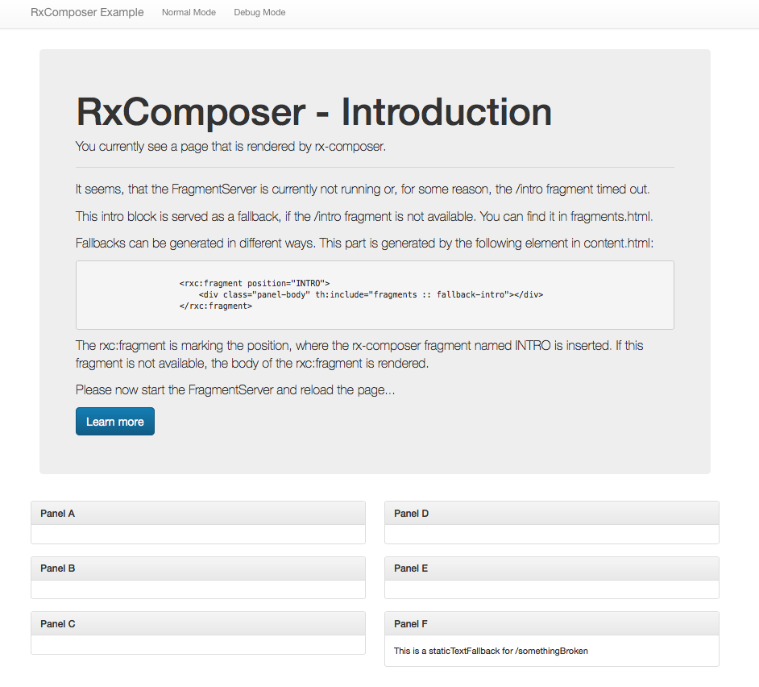
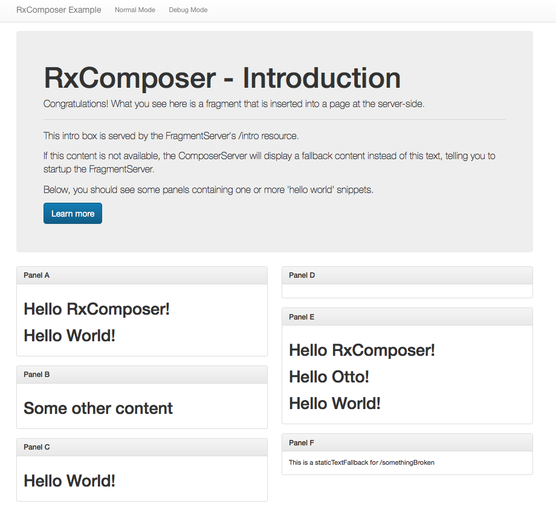

# The Examples

The project contains an example consisting of two Spring Boot applications that can be found in the examples folder:

* examples/example-composer: This module contains a server application, that is using rx-composer to render a
 page that is consisting of a number of fragments. The fragments are served by the second module:
* examples/example-fragments: Here you can find another server that has a few HTTP endpoints, serving some simple HTML
fragments.

Lets first see, what this example is doing and start the example-composer:

```
gradle examples:example-composer:bootRun
```

When the server has started, open `http://localhost:8080` in your browser. You will now see a page,
that is telling you to start the fragment server:




Now we start the example-fragments server and reload the page:

```
gradle examples:example-fragments:bootRun
```

After reloading, you should see the same page, but now containing some contents in the different panels.



So what happened? The `ComposerServer` has rendered a page using a Thymeleaf template (`content.html`). The
template contains some fragments served by the `FragmentServer`. In the first step, these fragments
where not available, because the server was not yet running. Only the 'Introduction' block and the
last panel contained some text: These are examples on how to specify fallbacks, if an included fragment
is not available. We will come back to this topic when we are talking about [resiliency](#resiliency) and
[fallbacks](#fallbacks).

After the `FragmentServer` started, the included (or [transcluded](https://www.mediawiki.org/wiki/Transclusion)
fragments where rendered.

> Please note, that sometimes you have to reload the page twice to get all contents. For some reason, the very
first request to a service is taking too long, so some requests are timing out. I'm working on it :-)

The `example-composer` consists of three classes:
1. The `ComposerServer`, which is a standard Spring Boot Application. You can start this class in your
  IDE to start up the server.
2. The `PageConfiguration`, which is a Spring Boot `@Configuration` class. This class is configuring two things:
    * The `Page` that describes which (and how) fragments are fetched.
    * The `ServiceClients` used to fetch HTTP content for the different fragments.
3. Finally, the `ContentController`, which is a simple Spring controller that is using the `Page` object to
fetch the contents.

## ContentController

Let's start with the controller:

```java
    final Contents contents = page.fetchWith(emptyParameters(), loggingStatisticsTracer());
```

The configured `page` is used to `fetch` contents. After executing this, the `Contents` can
be used inside a Thymeleaf template (or whatever templating engine you might prefer) to put
the fragements of the page whereever you like.

The easiest way to include a fragment into a Thymeleaf template is to use the `rxc:fragment` element:

```xml
    <rxc:fragment position="INTRO">
        <!-- here you could add code that is rendered, if the INTRO fragment is unavailable -->
    </rxc:fragment>
```


## PageConfiguration

The Page object that is used by the controller is coming from `PageConfiguration`. It basically defines the structure
of the fragments and their sources. The INTRO fragement, for example, is configured like this:

```java
    Page.consistsOf(
            fragment(INTRO, withSingle(
                    contentFrom(clients.getBy(introService), "http://localhost:8081/intro", TEXT_HTML))
            ),
            ...

```

## ServiceClients

In order to get the content from the `/intro` service, a `ServiceClient` is used. These clients primarily refer
to an HTTP client. In order to use differently configured clients, the `PageConfiguration` also configures a number of
`ServiceClients`:

```java
    clients = serviceClients(
                singleRetry(introService, 5000, 1000),
                singleRetry(helloService, 5000, 500),
                noResiliency(somethingElseService, 5000, 400),
                singleRetry(serviceC, 5000, 1000),
                singleRetry(someMissingService, 5000, 480),
                noRetries(someBrokenService, 5000, 550)
        );
```

Every client may use different timeouts and/or other resiliency patterns like circuit-breakers, retries or fallbacks.

## More information

The [getting started](./GETTINGSTARTED.md) will help you to get up and running with your own project.
There also is a [user guide](./USERGUIDE.md) that containing more detailed information about the concepts of
`rx-composer`.

Have fun!